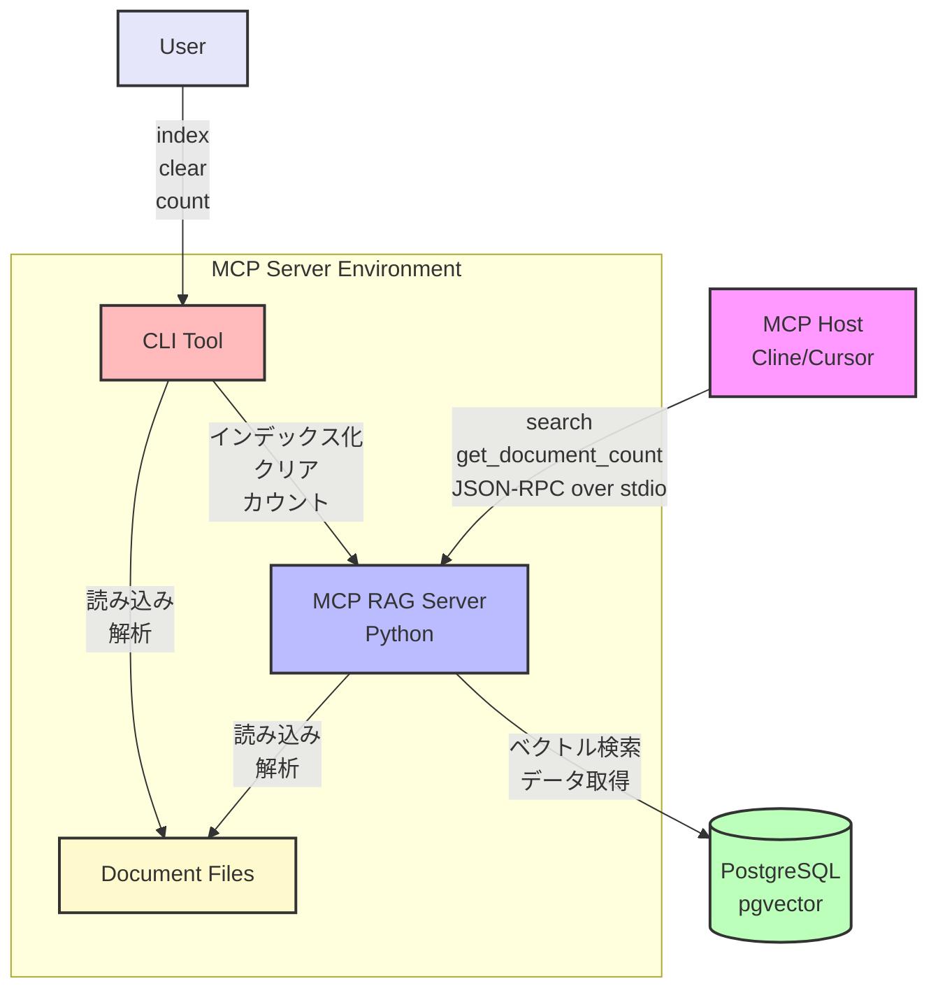
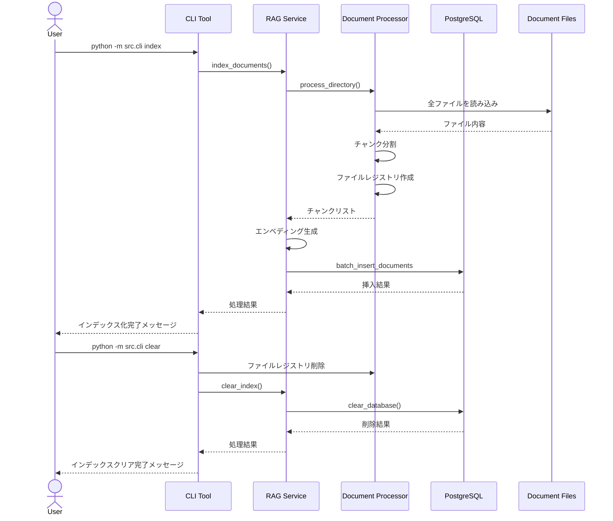
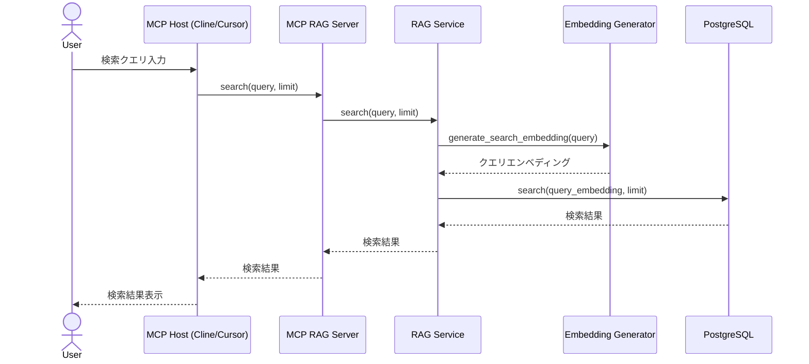

# 要件・設計書

## 1. 要件定義

### 1.1 基本情報
- ソフトウェア名称: MCP RAG Server
- リポジトリ名: mcp-rag-server

### 1.2 プロジェクト概要

本プロジェクトは、Model Context Protocol (MCP)に準拠したRAG（Retrieval-Augmented Generation）機能を持つPythonサーバーを提供することを目的とする。マークダウンファイル、テキストファイル、パワーポイント、PDFなど複数の形式のドキュメントをデータソースとして、multilingual-e5-largeモデルを使用してインデックス化し、ベクトル検索によって関連情報を取得する機能を提供する。

### 1.3 機能要件

#### 1.3.1 MCPサーバーの基本実装
- JSON-RPC over stdioベースで動作
- ツールの登録と実行のためのメカニズム
- エラーハンドリングとロギング

#### 1.3.2 RAG機能
- 複数形式のドキュメント（マークダウン、テキスト、パワーポイント、PDF）の読み込みと解析
- 階層構造を持つソースディレクトリに対応
- Markitdownを使用したパワーポイントやPDFからのマークダウン変換
- multilingual-e5-largeモデルを使用したエンベディング生成
- PostgreSQLのpgvectorを使用したベクトルデータベース
- ベクトル検索による関連情報の取得
- 前後のチャンク取得機能（コンテキストの連続性を確保）
- ドキュメント全文取得機能（完全なコンテキストを提供）
- 差分インデックス化機能（新規・変更ファイルのみを処理）

#### 1.3.3 ツール
- ベクトル検索ツール（MCP）
- ドキュメント数取得ツール（MCP）
- インデックス管理ツール（CLI）

### 1.4 非機能要件

- 迅速なレスポンス
- シンプルな構成とメンテナンス性重視
- 拡張性の高い設計

### 1.5 制約条件

- Python 3.10以上で動作
- JSON-RPC over stdioベースで動作
- PostgreSQLとpgvectorエクステンションが必要

### 1.6 開発環境

- 言語: Python
- 外部ライブラリ:
  - `mcp[cli]` (Model Context Protocol)
  - `python-dotenv`
  - `psycopg2-binary` (PostgreSQL接続)
  - `sentence-transformers` (エンベディング生成)
  - `markdown` (マークダウン解析)
  - `numpy` (ベクトル操作)

### 1.7 成果物

- Python製MCPサーバー
- RAG機能の実装
- README / 利用手順
- 設計書

## 2. システム設計

### 2.1 システム概要設計

#### 2.1.1 システムアーキテクチャ

##### システム構成図



##### インデックス化のシーケンス図



##### RAG（検索）のシーケンス図



#### 2.1.2 主要コンポーネント
- **MCPサーバー**
  - JSON-RPC over stdioをリッスン
  - ツールの登録と実行を管理
- **ドキュメント管理**
  - 複数形式のドキュメントの読み込みと解析
  - Markitdownを使用した形式変換
  - チャンク分割
  - ファイルレジストリによる差分管理
- **エンベディング生成**
  - multilingual-e5-largeモデルを使用
  - テキストからベクトル表現を生成
- **ベクトルデータベース**
  - PostgreSQLとpgvectorを使用
  - ベクトルの保存と検索

### 2.2 詳細設計

#### 2.2.1 クラス設計

##### `MCPServer`
```python
class MCPServer:
    def register_tool(name: str, description: str, input_schema: Dict[str, Any], handler: Callable) -> None
    def start(server_name: str, version: str, description: str) -> None
    def _handle_tools_call(params: Dict[str, Any], request_id: Any) -> None
```

##### `DocumentProcessor`
```python
class DocumentProcessor:
    def read_file(file_path: str) -> str
    def convert_to_markdown(file_path: str) -> str
    def split_into_chunks(text: str, chunk_size: int, overlap: int) -> List[str]
    def calculate_file_hash(file_path: str) -> str
    def get_file_metadata(file_path: str) -> Dict[str, Any]
    def load_file_registry(processed_dir: str) -> Dict[str, Dict[str, Any]]
    def save_file_registry(processed_dir: str, registry: Dict[str, Dict[str, Any]]) -> None
    def process_file(file_path: str, processed_dir: str, chunk_size: int, overlap: int) -> List[Dict[str, Any]]
    def process_directory(source_dir: str, processed_dir: str, chunk_size: int, overlap: int, incremental: bool = False) -> List[Dict[str, Any]]
```

##### `EmbeddingGenerator`
```python
class EmbeddingGenerator:
    def __init__(model_name: str)
    def generate_embedding(text: str) -> List[float]
    def generate_embeddings(texts: List[str]) -> List[List[float]]
    def generate_search_embedding(query: str) -> List[float]
```

##### `VectorDatabase`
```python
class VectorDatabase:
    def __init__(connection_params: Dict[str, Any])
    def initialize_database() -> None
    def insert_document(document_id: str, content: str, file_path: str, chunk_index: int, embedding: List[float], metadata: Dict[str, Any]) -> None
    def batch_insert_documents(documents: List[Dict[str, Any]]) -> None
    def search(query_embedding: List[float], limit: int = 5) -> List[Dict[str, Any]]
    def delete_document(document_id: str) -> None
    def delete_by_file_path(file_path: str) -> int
    def clear_database() -> int
    def get_document_count() -> int
    def get_adjacent_chunks(file_path: str, chunk_index: int, context_size: int = 1) -> List[Dict[str, Any]]
    def get_document_by_file_path(file_path: str) -> List[Dict[str, Any]]
```

##### `RAGService`
```python
class RAGService:
    def __init__(document_processor: DocumentProcessor, embedding_generator: EmbeddingGenerator, vector_database: VectorDatabase)
    def index_documents(source_dir: str, processed_dir: str = None, chunk_size: int = 500, chunk_overlap: int = 100, incremental: bool = False) -> Dict[str, Any]
    def search(query: str, limit: int = 5, with_context: bool = False, context_size: int = 1, full_document: bool = False) -> List[Dict[str, Any]]
    def clear_index() -> Dict[str, Any]
    def get_document_count() -> int
```

#### 2.2.2 データベーススキーマ

```sql
-- ドキュメントテーブル
CREATE TABLE documents (
    id SERIAL PRIMARY KEY,
    document_id TEXT UNIQUE NOT NULL,
    content TEXT NOT NULL,
    file_path TEXT NOT NULL,
    chunk_index INTEGER NOT NULL,
    embedding vector(1024),  -- multilingual-e5-largeの次元数
    created_at TIMESTAMP WITH TIME ZONE DEFAULT CURRENT_TIMESTAMP,
    metadata JSONB
);

-- インデックス
CREATE INDEX idx_documents_embedding ON documents USING ivfflat (embedding vector_cosine_ops);
```

### 2.3 インターフェース設計

#### 2.3.1 MCPツール

##### `search`
ベクトル検索を行うツール

- 入力パラメータ:
  - `query`: 検索クエリ
  - `limit` (オプション): 返す結果の数（デフォルト: 5）
  - `with_context` (オプション): 前後のチャンクも取得するかどうか（デフォルト: true）
  - `context_size` (オプション): 前後に取得するチャンク数（デフォルト: 1）
  - `full_document` (オプション): ドキュメント全体を取得するかどうか（デフォルト: false）

- 出力:
  - 検索結果のリスト（ファイルパスとチャンクインデックスでソート）
    - ドキュメントID
    - コンテンツ
    - ファイルパス
    - チャンクインデックス
    - 関連度スコア
    - メタデータ
    - コンテキストフラグ（前後のチャンクの場合はTrue）
    - 全文ドキュメントフラグ（ドキュメント全体の場合はTrue）

##### `get_document_count`
インデックス内のドキュメント数を取得するツール

- 入力パラメータ: なし

- 出力:
  - ドキュメント数

#### 2.3.2 CLIコマンド

##### `index`
ドキュメントをインデックス化するコマンド

- 引数:
  - `--directory`, `-d`: インデックス化するドキュメントが含まれるディレクトリのパス（デフォルト: ./data/source）
  - `--chunk-size`, `-s`: チャンクサイズ（文字数）（デフォルト: 500）
  - `--chunk-overlap`, `-o`: チャンク間のオーバーラップ（文字数）（デフォルト: 100）
  - `--incremental`, `-i`: 差分のみをインデックス化するかどうか（フラグ）

##### `clear`
インデックスをクリアするコマンド

- 引数: なし

##### `count`
インデックス内のドキュメント数を取得するコマンド

- 引数: なし

### 2.4 セキュリティ設計

- 環境変数で機密情報を管理（`.env`）
  - PostgreSQL接続情報
- 外部からの直接アクセスは制限（ローカル環境前提）

### 2.5 テスト設計

- 単体テスト
  - 各コンポーネントの機能テスト
  - MCPサーバーの基本機能テスト
- 統合テスト
  - RAG機能の統合テスト
  - MCPリクエストを模擬した動作確認

### 2.6 開発環境・依存関係

- Python 3.10+
- PostgreSQL 14+（pgvectorエクステンション付き）
- 必要なPythonパッケージ:
  - `mcp[cli]`
  - `python-dotenv`
  - `psycopg2-binary`
  - `sentence-transformers`
  - `markdown`
  - `numpy`
  - `markitdown-mcp`

### 2.7 ファイル構造

```
mcp-rag-server/
├── data/
│   ├── source/        # 原稿ファイル（階層構造対応）
│   │   ├── markdown/  # マークダウンファイル
│   │   ├── docs/      # ドキュメントファイル
│   │   └── slides/    # プレゼンテーションファイル
│   └── processed/     # 処理済みファイル（テキスト抽出済み）
│       └── file_registry.json  # 処理済みファイルの情報（差分インデックス用）
├── docs/              # プロジェクトドキュメント
├── logs/              # ログファイル
├── src/               # ソースコード
└── tests/             # テストコード
```

### 2.8 開発工程

| フェーズ | 内容 | 期間 |
|---------|------|------|
| 要件定義 | 本仕様書作成 | 第1週 |
| 設計 | アーキテクチャ・モジュール設計 | 第1週 |
| 実装 | 各モジュールの開発 | 第2週 |
| テスト | 単体・統合テスト | 第3週 |
| リリース | ドキュメント整備・デプロイ対応 | 第3週 |

## 3. 実装ガイド

### 3.1 PostgreSQLとpgvectorのセットアップ

#### 3.1.1 Dockerを使用する場合

```bash
# pgvectorを含むPostgreSQLコンテナを起動
docker run --name postgres-pgvector -e POSTGRES_PASSWORD=password -p 5432:5432 -d pgvector/pgvector:pg14
```

#### 3.1.2 既存のPostgreSQLにpgvectorをインストールする場合

```bash
# pgvectorエクステンションをインストール
CREATE EXTENSION vector;
```

### 3.2 環境変数の設定

`.env`ファイルに以下の環境変数を設定:

```
# PostgreSQL接続情報
POSTGRES_HOST=localhost
POSTGRES_PORT=5432
POSTGRES_USER=postgres
POSTGRES_PASSWORD=password
POSTGRES_DB=ragdb

# ドキュメントディレクトリ
SOURCE_DIR=./data/source
PROCESSED_DIR=./data/processed

# エンベディングモデル
EMBEDDING_MODEL=intfloat/multilingual-e5-large
```

### 3.3 実装の流れ

1. 基本的なMCPサーバーの実装
2. ドキュメント処理コンポーネントの実装
   - 複数形式のファイル読み込み
   - Markitdownを使用した変換
   - 階層構造対応
   - ファイルレジストリによる差分管理
3. エンベディング生成コンポーネントの実装
4. ベクトルデータベースコンポーネントの実装
5. RAGサービスの実装
6. MCPツールの実装と登録
7. CLIコマンドの実装
8. テストとデバッグ

### 3.4 使用例

#### 3.4.1 CLIによるインデックス化

```bash
# 全件インデックス化
python -m src.cli index

# 差分インデックス化
python -m src.cli index -i
```

#### 3.4.2 CLIによるインデックスのクリア

```bash
python -m src.cli clear
```

#### 3.4.3 MCPによる検索

```json
{
  "jsonrpc": "2.0",
  "method": "search",
  "params": {
    "query": "Pythonのジェネレータとは何ですか？",
    "limit": 5,
    "with_context": true,
    "context_size": 1,
    "full_document": false
  },
  "id": 1
}
```

##### 前後のチャンクを取得する例

```json
{
  "jsonrpc": "2.0",
  "method": "search",
  "params": {
    "query": "Pythonのジェネレータとは何ですか？",
    "limit": 3,
    "with_context": true,
    "context_size": 2
  },
  "id": 1
}
```

##### ドキュメント全体を取得する例

```json
{
  "jsonrpc": "2.0",
  "method": "search",
  "params": {
    "query": "Pythonのジェネレータとは何ですか？",
    "limit": 3,
    "full_document": true
  },
  "id": 1
}
```

#### 3.4.4 MCPによるドキュメント数の取得

```json
{
  "jsonrpc": "2.0",
  "method": "get_document_count",
  "params": {},
  "id": 2
}
